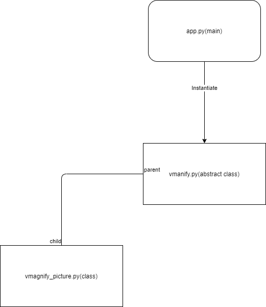

# Architecture

- [Architecture](#architecture)
  - [Intro](#intro)
  - [Application architecture](#application-architecture)
  - [app.py file](#apppy-file)
  - [vmanify_picture class](#vmanify_picture-class)
    - [Properties](#properties)
    - [Methods](#methods)
      - [__generate_pictures() method](#__generate_pictures-method)
      - [process_url() method](#process_url-method)

## Intro

The VMagnify application is a server software designed to communicate with the user browser via HTTP.

## Application architecture

The application is composed of 3 source files :

1. app.py is the main application file.
2. vmanify.py is an abstract class to share code between picture and video processings.
3. vmanify_picture.py is the class for picture processing.

## app.py file

app.py is the main file of the application, it contains the UI and the callback which is the core of the application.

## vmanify_picture class

The vmanify_picture is the class for picture processing.

### Properties

The class has 4 properties, all are of the type Mat :

1. original_picture : original picture of the user
2. x2_zoom_picture : picture processed with a X2 zoom
3. x3_zoom_picture : picture processed with a X3 zoom
4. x4_zoom_picture : picture processed with a X4 zoom

They have as goal to contain the result of the processing to permit to switch between pictures fastly.

### Methods

The class has 8 methods, in Python methods which start with __ are by convention private :

1. __download_url_content(r: requests.Response, file_extension: str): str
2. __generate_pictures()
3. __get_shape(index: int): str
4. __get_url(url: str): requests.Response, str
5. __process_picture(model_path: str, mutex: Lock, index: int)
6. __validate_file(path: str): bool
7. get_picture_data(index: int): str, str
8. process_url(url: str): str, str

#### __generate_pictures() method

__generate_pictures() method is responsible of the read of the input picture and the process of the 3 zoomed pictures.
The input of the method is the file path of the picture.

.png)

#### process_url() method

process_url() method is responsible of the download of the url of the user and the process of it.

.png)

The functions called by the method are :

1. __get_url(url:str) : requests.Response, str : this function requests the URL, more informations in [Specifications](../Specifications/README.md). It returns a tuple with the response and the file extension.
2. __download_url_content(r: requests.Response, file_extension: str) : str : this function is responsible of the download of the picture in the URL on the server. It returns the file path.
3. __validate_file (path : str) : bool : this function is responsible of the test of the validity of the picture, more informations in [Specifications](../Specifications/README.md). It returns True in case of success.
4. __generate_pictures() : see the chapiter of __generate_pictures() method above.
5. get_picture_data(index: int): str, str : this function returns the path of the corresponding picture and its shape data.
